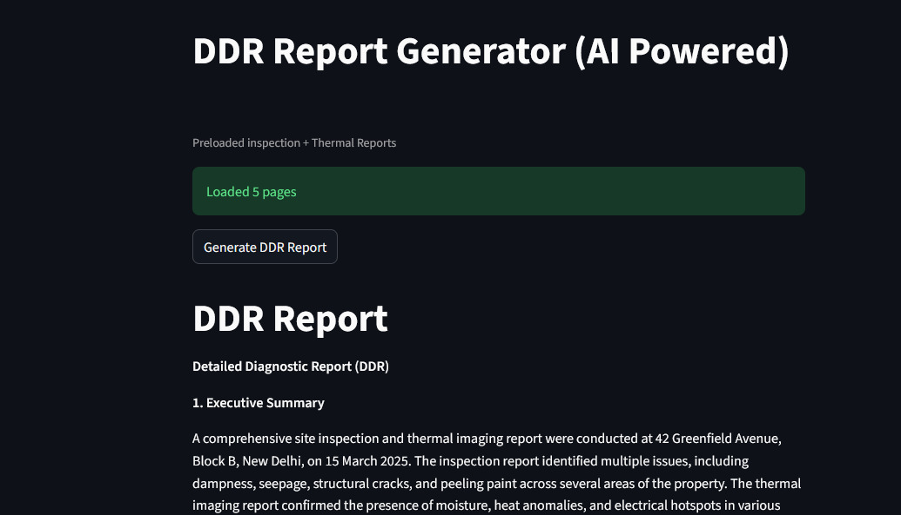

#  AI-Powered DDR Report Generator

An advanced **AI-driven system** that automatically generates **Detailed Diagnostic Reports (DDR)** by analyzing inspection and thermal PDF documents using a **Retrieval-Augmented Generation (RAG)** pipeline.


## Live Demos
- **DDR-Report**: [Click here to view](https://ddr-report.streamlit.app/)

## screenshot



##  Overview

This project transforms raw inspection and thermal data into structured, professional reports by combining:

-  Multi-document understanding  
-  Semantic search (FAISS)  
-  Large Language Models (Groq LLM)  

The system performs **cross-document reasoning**, identifies issues, assigns severity levels, and produces **client-ready diagnostic reports**.

##  Key Features

-  **Multi-PDF Processing** – Handles inspection and thermal reports together  
-  **Text Chunking** – Breaks documents into smaller meaningful parts  
-  **Embeddings** – Converts text into vector representations  
-  **FAISS Vector Search** – Fast and accurate semantic retrieval  
-  **Cross-Analysis** – Combines inspection + thermal insights  
-  **Severity Classification** – LOW / MEDIUM / HIGH issue detection  
-  **Structured DDR Output** – Professional report format  
-  **Downloadable Report** – Export generated report  

##  How It Works

### Workflow

1. **Load PDFs**
   - Reads inspection and thermal reports  

2. **Chunking**
   - Splits documents into smaller chunks  

3. **Embeddings**
   - Converts text into numerical vectors  

4. **FAISS Vector Store**
   - Stores embeddings for fast similarity search  

5. **Retriever**
   - Fetches relevant chunks based on query  

6. **LLM (Groq)**
   - Generates structured DDR report using context  

7. **Output**
   - Displays and allows download of report  

##  Output Format

The generated DDR report includes:

- Executive Summary  
- Key Findings  
- Detailed Issues (Location, Issue, Severity, Evidence)  
- Structural Observations  
- Thermal Observations  
- Recommendations  
- Conclusion  


##  Tech Stack

| Category | Tools |
|--------|------|
| Frontend | Streamlit |
| Backend | Python |
| LLM | Groq (Llama 3.1) |
| Framework | LangChain |
| Vector DB | FAISS |
| Embeddings | Sentence Transformers |
| PDF Processing | PyPDF |


##  Installation

```bash
git clone https://github.com/your-username/ai-ddr-report-generator.git
cd ai-ddr-report-generator
pip install -r requirements.txt
```

##  Environment Setup
Create a `.env` file in the root directory and add the following:

```env
GROQ_API_KEY=your_api_key_here
```
Replace `your_api_key_here` with your actual API key. You can obtain the API key from the Groq platform.


##  Usage
Run the application using the following command:

```bash
streamlit run main.py
```
Open the provided URL in your browser to access the application.

##  Project Structure

```
ai-ddr-report-generator/
│── main.py
│── requirements.txt
│── inspection_report.pdf
│── thermal_report.pdf
│── README.md
│── .env
```

- **main.py**: Entry point of the application.
- **requirements.txt**: Contains the list of dependencies.
- **inspection_report.pdf**: Example inspection report.
- **thermal_report.pdf**: Example thermal report.
- **README.md**: Project documentation.
- **.env**: Environment variables file.

---

##  Contributing

Contributions are welcome! Feel free to open issues or submit pull requests. To contribute:

1. Fork the repository.
2. Create a new branch for your feature or bug fix.
3. Commit your changes and push the branch.
4. Open a pull request.

##  License

This project is licensed under the MIT License. See the [LICENSE](LICENSE) file for details.