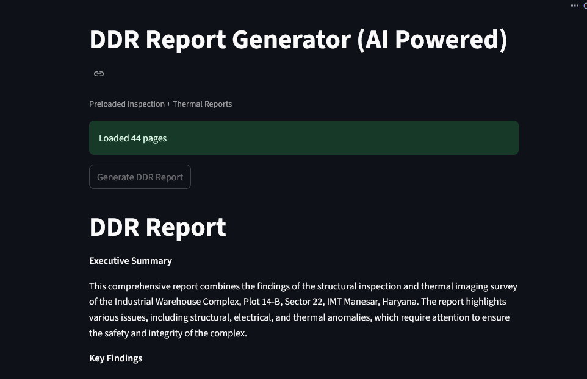
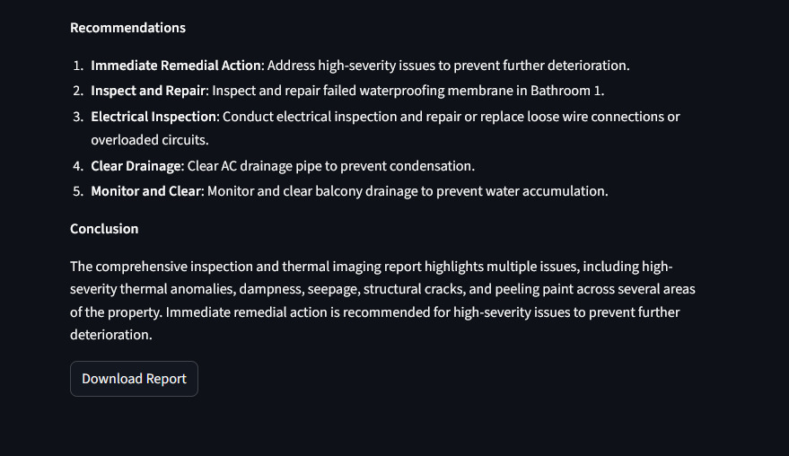

#  AI-Powered DDR Report Generator

An advanced **AI-driven system** that automatically generates **Detailed Diagnostic Reports (DDR)** by analyzing inspection and thermal PDF documents using a **Retrieval-Augmented Generation (RAG)** pipeline.

> **Processes multi-document reports (20-25+ pages) in nearly 29 seconds!**

##  Live Demos
- **DDR-Report**: [Click here to view](https://ddr-report.streamlit.app/)

##  Problem Statement

Manual analysis of inspection and thermal reports is:

-  Time-consuming (hours per report)  
-  Error-prone  
-  Difficult to scale  

##  Solution

This project automates report generation using AI:

- Processes multi-PDF documents  
- Applies semantic search (FAISS)  
- Uses LLM for reasoning  

 Reduces analysis time from hours → ~26 seconds

##  Screenshots




##  Overview

This project transforms raw inspection and thermal data into structured, professional reports by combining:

-  Multi-document understanding  
-  Semantic search (FAISS)  
-  Large Language Models (Groq LLM)  

The system performs **cross-document reasoning**, identifies issues, assigns severity levels, and produces **client-ready diagnostic reports**.

##  Key Features

-  **Multi-PDF Processing** – Handles inspection and thermal reports together  
-  ** Intelligent Text Chunking** – Breaks documents into smaller meaningful parts  
-  **AI Embeddings** – Converts text into vector representations  
-  **FAISS Vector Search** – Fast and accurate semantic retrieval  
-  **Cross-Document Analysis** – Combines inspection + thermal insights  
-  **Severity Classification** – LOW / MEDIUM / HIGH issue detection  
-  **Structured DDR Output** – Professional report format  
-  **Downloadable Reports** – Export generated reports instantly  

##  How It Works

### Workflow Diagram

```
PDFs (20-25+ pages) 
    ↓
[Text Extraction & Cleaning]
    ↓
[Intelligent Chunking]
    ↓
[Vector Embeddings]
    ↓
[FAISS Vector Store]
    ↓
[Semantic Retrieval]
    ↓
[Groq LLM Processing]
    ↓
[Structured DDR Report]
    ↓
[29 seconds ✓]
```

### Step-by-Step Process

1. **Load PDFs**
   - Reads inspection and thermal reports simultaneously
   - Supports documents up to 25+ pages
   - Example: `inspection_1.pdf` (23 pages) + `thermal_1.pdf` (21 pages)

2. **Intelligent Chunking**
   - Splits documents into semantically meaningful chunks
   - Preserves context and relationships between segments

3. **Generate Embeddings**
   - Converts text into numerical vectors using Sentence Transformers
   - Enables semantic understanding and similarity matching

4. **FAISS Vector Store**
   - Stores embeddings for lightning-fast similarity search
   - Retrieves relevant context in milliseconds

5. **Semantic Retrieval**
   - Fetches most relevant chunks based on specific queries
   - Ensures accurate and contextual information extraction

6. **LLM Processing (Groq Llama 3.1)**
   - Analyzes retrieved context intelligently
   - Generates structured DDR report with cross-document insights
   - Classifies issues by severity level

7. **Professional Output**
   - Displays formatted report in Streamlit interface
   - Enables instant download for documentation

##  Output Format

The generated DDR report includes:

- **Executive Summary** – High-level overview of findings
- **Key Findings** – Critical issues and observations  
- **Detailed Issues** – Location, Issue Description, Severity Level, Evidence & References  
- **Structural Observations** – Building integrity analysis  
- **Thermal Observations** – Temperature and thermal patterns  
- **Recommendations** – Actionable next steps  
- **Conclusion** – Final assessment and summary  

##  Performance & Processing

| Metric | Details |
|--------|---------|
| **Processing Time** | ~29 seconds for 20-25+ page documents |
| **Document Handling** | Simultaneous multi-PDF analysis |
| **Example Documents** | `inspection_1.pdf` (23 pages) + `thermal_1.pdf` (21 pages) |
| **Output Quality** | Enterprise-grade structured reports |
| **Search Latency** | Sub-millisecond semantic retrieval |

**Why 29 seconds?**
- PDF parsing and text extraction (~6s)
-  Semantic chunking and preprocessing (~4s)
-  Vector embedding generation (~8s)
-  FAISS indexing and similarity search (~3s)
-  LLM-based report synthesis (~8s)

##  Tech Stack

| Category | Tools |
|--------|------|
| **Frontend** | Streamlit |
| **Backend** | Python |
| **LLM Engine** | Groq (Llama 3.1) |
| **RAG Framework** | LangChain |
| **Vector Database** | FAISS |
| **Embeddings** | Sentence Transformers |
| **PDF Processing** | PyPDF |
| **Data Processing** | Pandas, NumPy |

##  Installation

```bash
git clone https://github.com/your-username/ai-ddr-report-generator.git
cd ai-ddr-report-generator
pip install -r requirements.txt
```

##  Environment Setup

Create a `.env` file in the root directory and add the following:

```env
GROQ_API_KEY=your_api_key_here
```

> **Note:** Replace `your_api_key_here` with your actual API key from the [Groq platform](https://console.groq.com).

##  Usage

Run the application using the following command:

```bash
streamlit run main.py
```

Then:
1. Open the provided URL in your browser (typically `http://localhost:8501`)
2. Upload inspection and thermal PDF reports
3. Wait ~26 seconds for processing
4. Review the generated DDR report
5. Download the report for your records

**Sample Documents Available:**
- **inspection_1.pdf** – 23-page comprehensive inspection report
- **thermal_1.pdf** – 21-page detailed thermal analysis report

##  Project Structure

```
ai-ddr-report-generator/
│
├── main.py                          # Entry point
├── requirements.txt                 # Dependencies
├── README.md                        # Documentation
├── .env                             # Environment variables
│
├── inspection_1.pdf                 # 23-page inspection report
├── thermal_1.pdf                    # 21-page thermal report
├── inspection_report.pdf            # Example inspection report
├── thermal_report.pdf               # Example thermal report
│
└── .gitignore                       # Git exclusions
```

| File | Description |
|------|-------------|
| **main.py** | Entry point of the application |
| **requirements.txt** | Python dependencies |
| **inspection_1.pdf** | Full inspection report (23 pages) |
| **thermal_1.pdf** | Full thermal report (21 pages) |
| **inspection_report.pdf** | Sample inspection report |
| **thermal_report.pdf** | Sample thermal report |
| **README.md** | Project documentation |
| **.env** | Environment variables & API keys |

---

##  Contributing

Contributions are welcome! Feel free to open issues or submit pull requests. To contribute:

1. **Fork** the repository
2. **Create** a new branch (`git checkout -b feature/your-feature`)
3. **Commit** your changes (`git commit -m 'Add new feature'`)
4. **Push** to the branch (`git push origin feature/your-feature`)
5. **Open** a pull request

##  License

This project is licensed under the MIT License. See the [LICENSE](LICENSE) file for details.
